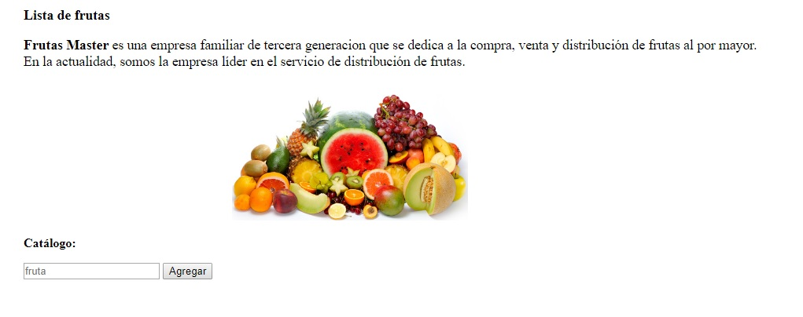
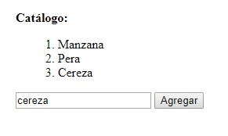

# lista de frutas
***
## rama gh-pages
***
programa que muestra una __lista de frutas__

* contiene un _html_
* contiene un _javascript_, permite agregar frutas a la lista
> contiene comentarios

``` javascript
var listaFrutas = []; //array que contiene la lista de frutas
function agregar() {
  var fruta = document.getElementById('fruta').value;//se obtiene lo que se ingresa en la caja de texto
  listaFrutas.push(fruta);//se agrega al array
  var resultado = '';//se crea una variable que contendra la lista
  for(i in listaFrutas){
    resultado += (Number(i)+1) + '. ' + listaFrutas[i].slice(0,1).toUpperCase() + listaFrutas[i].slice(1) + '<br>';
  }//todo lo agregado, la primera letra es en mayuscula
  document.getElementById('resultado').innerHTML = resultado; //se imprime la lista
  fruta = '';//la caja de texto vuelve a estar en blanco
}
```
Resultado :


